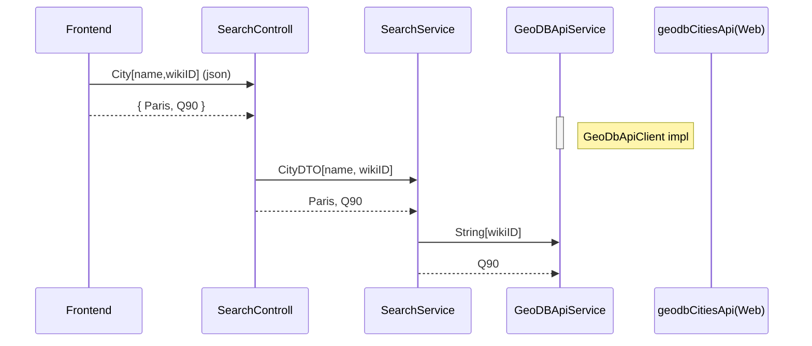

# Specification (hungarian)
Fejlesztési feladat
Egy szabadon választott technológia segítségével (android, java/spring, php/html, python / tkiner, asp.net stb) egy bejelentkező webes felületet kellene implementálni. A felületen felhasználónév és jelszó adatok megadására lenne lehetőség. A felhasználónév és a jelszó legyen a kódba „beégetve”. A bejelentkezés gombra kattintva, ha helyesen lettek megadva a bejelentkezési adatok (Ellenkező esetben jelenjen meg, hogy „Hibás belépési adatok”), nyíljon meg egy új ablak, ahol jelenjen meg egy lenyíló választó menü 5db városnévvel. Lenyitás után kiválasztunk egy várost és a keresés gombra kattintva küldjük el a városnevet egy POST kéréssel a http://geodb-cities-api.wirefreethought.com/docs/api/find-places weboldal API-jának, ahonnan válaszként a paraméterek között visszaérkezik a város szélességi és hosszúsági koordinátája. A koordinátákat az oldal jelenítse meg egy google térképen.
A megoldás elküldéséhez szükség lesz egy privát github repository-ra, amin megnézzük a megoldás kódját.

# Operations
| Operation | Url           | description                                            |
|-----------|---------------|--------------------------------------------------------|
| POST      | /login/submit | Retrieve username and password - non secured!   //TODO |    
| POST      | /search/city  | Send city name to GEODB Api.                           |

# Documentations
- GoeDB: https://github.com/wirefreethought/geodb-java-client

# Layers

(More info about mermaid sequenceDiagram: https://mermaid.js.org/syntax/sequenceDiagram.html)

## Used code sources:
- https://medium.com/swlh/how-to-create-your-first-login-page-with-html-css-and-javascript-602dd71144f1
- https://www.geeksforgeeks.org/how-to-get-selected-value-in-dropdown-list-using-javascript/
- https://developers.google.com/maps/documentation/javascript/adding-a-google-map#maps_add_map-javascript